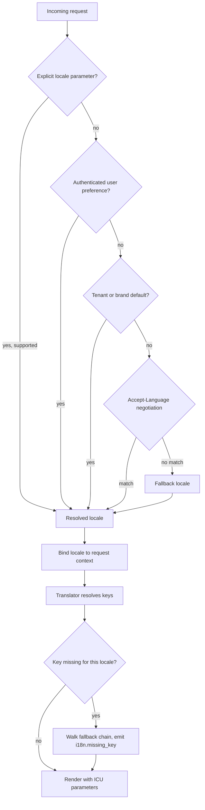
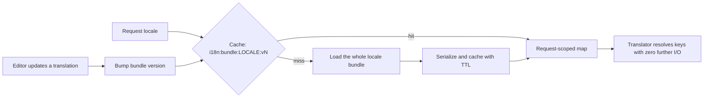
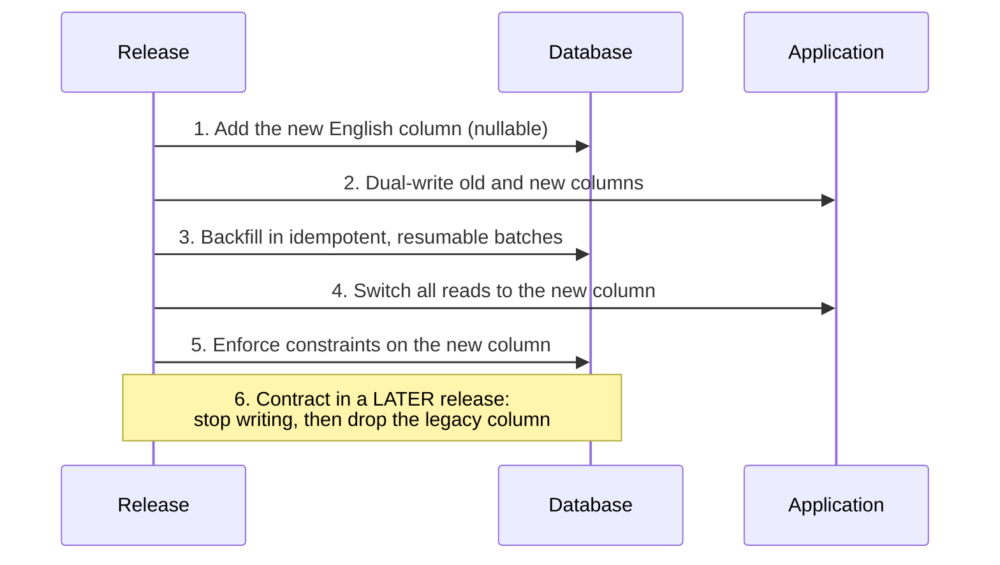

# Language & Internationalization Standard

**Type:** Portable engineering standard — adopt as-is in any project, any stack
**Status:** Normative. A deviation is a defect, not a style opinion.
**Audience:** Human contributors and AI coding agents

> This document is written in English on purpose. If a standard demanding an
> English codebase were itself written in the team's local language, it would be
> violating itself on line one.

---

## 0. Adoption in three steps

| Step | Action | Artifact |
|---|---|---|
| 1 | Fill in §1 (Project Profile) and commit this file | `docs/standards/LANGUAGE_AND_I18N.md` |
| 2 | Copy the short contract to the repository root | `AGENTS.md` → symlink `CLAUDE.md`, `.cursorrules` |
| 3 | Install the gate and wire it to pre-commit + CI | `tools/lint_language.py`, `language-standard.toml` |

Steps 1 and 2 alone do not work. A standard without a blocking check is a
suggestion, and both humans and language models drift back to the language of the
conversation as soon as the context gets long. **The exit code is the standard.**

---

## 1. Project Profile — fill this in

| Setting | Value | Used by |
|---|---|---|
| Team / conversation language | `<pt-BR>` | denylist selection in the gate |
| Code language | **English (en-US)** — non-negotiable | everything |
| Source locale for translation keys | `<en-US>` | catalog integrity check |
| Supported locales | `<en-US, pt-BR, es-ES>` | translator, CI |
| Fallback locale | `<en-US>` | translator |
| Primary stack | `<language / framework>` | naming table §4 |
| Translation storage | `<database \| files \| hybrid>` | §7.2 |
| Translation cache | `<Redis \| in-memory \| CDN \| none>` | §7.2 |
| Translator entry point | `<TranslationService.get(key, locale, **params)>` | gate config |
| Key format | `<domain>.<entity>.<element>[.<state>]` | gate config |
| Scan roots | `<src, app, tests>` | gate config |
| Exempt paths (localized copy) | `<lang/, locales/, translations/>` | gate config |

Everything the gate needs from this table lives in `language-standard.toml`. The
linter itself carries no project knowledge and is never edited per project.

---

## 2. The two rules

**R1 — The machine layer is English.**
Identifiers, schema objects, contract fields, logs, comments, commits: English.
The team speaking another language is an unrelated fact. Code is read by
strangers, tooling, auditors and models trained on English corpora.

**R2 — The human layer is never hardcoded.**
Every character an end user can read is a translation key resolved at runtime.
Not in code, not in templates, not in migrations, not in seeds, not in tests.

Everything below is these two rules made unambiguous enough to automate.

---

## 3. Scope matrix

| Layer | Artifact | Language |
|---|---|---|
| Code | modules, files, directories, packages | English |
| Code | classes, functions, methods, variables, parameters | English |
| Code | constants, enum members and enum types | English |
| Code | comments, docstrings, TODO/FIXME notes | English |
| Code | tests, fixtures, factories, mocks, snapshots | English |
| Data | tables, columns, indexes, constraints, views, sequences | English |
| Data | migration and seeder file names | English |
| Data | enum values persisted in the database | English |
| Config | environment variables, config keys, feature flags | English |
| Contract | JSON fields, query params, headers, route paths | English |
| Contract | machine error codes | English |
| Ops | log messages, metrics, spans, queue and job names | English |
| VCS | branches, commits, PR titles, changelogs, ADRs | English |
| Docs | README, runbooks, architecture docs | English |
| **UI** | labels, buttons, headings, placeholders, tooltips | **Translation key** |
| **UI** | validation, flash messages, empty and error states | **Translation key** |
| **UI** | e-mail, SMS, push, PDF, export, receipt content | **Translation key** |
| **UI** | human-readable labels of enum values | **Translation key** |
| **Legal** | terms, privacy, regulatory notices | **Per-jurisdiction document** |

> **Legal texts are not translations.** Terms of Service for Brazil, the EU and the
> US are three distinct instruments under LGPD, GDPR and state law. Version them
> per jurisdiction, reference them by identifier, never machine-translate them.

---

## 4. Naming conventions

Follow the ecosystem's idiom; the language is always English.

| Element | Python | TypeScript / JS | PHP | Go | SQL |
|---|---|---|---|---|---|
| File | `snake_case.py` | `kebab-case.ts` / `PascalCase.tsx` | `PascalCase.php` | `snake_case.go` | `snake_case.sql` |
| Class / type | `PascalCase` | `PascalCase` | `PascalCase` | `PascalCase` | — |
| Function / method | `snake_case()` | `camelCase()` | `camelCase()` | `PascalCase()` / `camelCase()` | `snake_case()` |
| Variable | `snake_case` | `camelCase` | `$camelCase` | `camelCase` | — |
| Constant | `UPPER_SNAKE` | `UPPER_SNAKE` | `UPPER_SNAKE` | `PascalCase` | `UPPER_SNAKE` |
| Boolean | `is_active` | `isActive` | `$isActive` | `IsActive` | `is_active` |

Cross-cutting rules:

| Element | Convention | Example |
|---|---|---|
| Function name | verb first, explicit | `calculate_order_total`, `fetchUserProfile` |
| Class name | singular noun phrase | `OrderProcessor`, `TranslationService` |
| Table | plural, `snake_case` | `user_accounts`, `translation_keys` |
| Column | singular, `snake_case` | `billing_address`, `created_at` |
| Foreign key | `<singular_table>_id` | `user_id` |
| Index | `idx_<table>_<columns>` | `idx_orders_user_id_created_at` |
| Unique constraint | `uq_<table>_<columns>` | `uq_users_email` |
| Check constraint | `ck_<table>_<rule>` | `ck_orders_total_non_negative` |
| Timestamp | `<verb_past>_at`, UTC | `created_at`, `cancelled_at` |
| Error code | `UPPER_SNAKE`, domain-prefixed | `ORDER_ALREADY_PAID` |
| Translation key | lower `dot.case` | `order.checkout.payment_failed` |
| Route | `kebab-case`, plural resources | `/api/v1/user-accounts` |
| Branch | `type/short-english-description` | `feat/dynamic-i18n` |
| Commit | Conventional Commits, imperative | `feat(i18n): resolve copy from translation service` |

**Abbreviations:** avoid, except universally understood ones (`id`, `url`, `api`,
`http`, `uuid`). Never invent abbreviations derived from the team's language.

**Local proper nouns stay local.** Legal and protocol identifiers are names, not
translations: `cpf`, `cnpj`, `pix_key`, `iban`, `swift_code`, `vat_number`, `ssn`.
Everything around them is English: `validate_cpf_checksum()`. Register them in the
gate's `allowlist`.

---

## 5. Database rules

1. **Never persist rendered copy.** Store the enum value or the key.

   ```sql
   -- WRONG
   status VARCHAR(20)   -- 'aguardando_aprovacao'
   label  VARCHAR(80)   -- 'Pedido pendente'

   -- RIGHT
   status VARCHAR(32) NOT NULL  -- 'pending_approval' → key: order.status.pending_approval
   ```

2. **User- or operator-authored multilingual content** (CMS blocks, product
   descriptions, promotions) uses a locale map with a mandatory source-locale entry:

   ```sql
   ALTER TABLE promotions
       ADD COLUMN title jsonb NOT NULL DEFAULT '{}'::jsonb,
       ADD CONSTRAINT ck_promotions_title_has_fallback CHECK (title ? 'en');
   ```

3. **Money:** integer minor units plus an ISO-4217 code (`amount_cents bigint`,
   `currency char(3)`). Never a float, never a formatted string. Formatting is a
   presentation concern.

4. **Time:** UTC in the database (`timestamptz` or equivalent). Timezone conversion
   happens at render time, driven by the user's profile.

5. **Migrations are English and reversible.** If the toolchain cannot drop or
   rename a column safely, plan the expand/contract sequence in §10 instead of an
   in-place rename.

---

## 6. API contract

- Field names are English `snake_case` (or the project's single documented
  convention) and are **part of the contract** — never localized, never renamed
  per market.
- The API returns data and machine codes; the client decides how to render.
- Failures carry a stable `code` plus a resolvable `message_key`. Any literal
  `message` is a debugging courtesy and must never be displayed to a user.

```json
{
  "error": {
    "code": "ORDER_PAYMENT_DECLINED",
    "message_key": "order.checkout.payment_declined",
    "message": "The payment was declined by the issuer.",
    "params": { "issuer_code": "51", "amount_cents": 12900, "currency": "BRL" }
  }
}
```

- Locale is negotiated per request, never per deployment.
- Localized responses echo the resolved locale: `Content-Language: pt-BR`.

---

## 7. The translation service

### 7.1 Locale resolution



Non-negotiable: the locale lives in the **request context**, never in a global or a
process-wide setting. One worker serves many locales concurrently. Background jobs
and queued e-mails have no request — they resolve from the recipient's stored
preference, which means the locale must be a persisted user attribute.

### 7.2 Storage strategy — pick one, write it in §1

| | **File catalogs** | **Database-driven** | **Hybrid** |
|---|---|---|---|
| Source of truth | JSON/YAML/PO in the repo | `translation_keys` + `translations` | DB, seeded from repo |
| Copy change | requires a deploy | no deploy | no deploy |
| Review flow | code review, versioned in Git | admin UI + audit columns | both |
| Non-technical editors | no | yes | yes |
| Runtime cost | zero | cached bundle per locale | cached bundle |
| Best for | small teams, few locales | copy owned by marketing / compliance | regulated products |

Minimal database shape when you choose DB-driven:

```sql
CREATE TABLE translation_keys (
    id           bigserial PRIMARY KEY,
    key          varchar(191) NOT NULL,
    domain       varchar(64)  NOT NULL,
    description  text,                                  -- context for translators
    placeholders jsonb NOT NULL DEFAULT '[]'::jsonb,
    is_active    boolean NOT NULL DEFAULT true,
    created_at   timestamptz NOT NULL DEFAULT now(),
    updated_at   timestamptz NOT NULL DEFAULT now(),
    CONSTRAINT uq_translation_keys_key UNIQUE (key),
    CONSTRAINT ck_translation_keys_format CHECK (key ~ '^[a-z0-9_]+(\.[a-z0-9_]+)+$')
);

CREATE TABLE translations (
    id                 bigserial PRIMARY KEY,
    translation_key_id bigint NOT NULL REFERENCES translation_keys (id) ON DELETE CASCADE,
    locale             varchar(10) NOT NULL,
    value              text NOT NULL,                   -- ICU message
    is_reviewed        boolean NOT NULL DEFAULT false,
    updated_by         bigint,
    updated_at         timestamptz NOT NULL DEFAULT now(),
    CONSTRAINT uq_translations_key_locale UNIQUE (translation_key_id, locale)
);
```

**Never query per string.** One round trip per rendered label is an outage waiting
for traffic. The access pattern:



- The cache unit is the **whole locale bundle**, never a single key.
- Invalidation is a **version bump** in the cache key, not a scan-and-delete.
- The cache is an accelerator, not a dependency: on cache failure, fall through to
  the store and log it. A cache outage must not take the product down.
- The frontend consumes the same bundle over `GET /api/v1/i18n/{locale}`, served
  with an ETag derived from the bundle version so it caches at the edge.

### 7.3 Key naming

`<domain>.<entity_or_screen>.<element>[.<state>]`

| Purpose | Key |
|---|---|
| Screen title | `order.checkout.title` |
| Action | `order.checkout.action.confirm` |
| Field label | `account.profile.field.phone_number` |
| Validation | `validation.email.already_registered` |
| Business error | `order.checkout.payment_declined` |
| Enum label | `order.status.shipped` |
| E-mail subject | `email.order_confirmed.subject` |

Keys are lowercase, dot-separated, **describe meaning not appearance**
(`action.confirm`, never `green_button`), and are stable: a key is part of the
contract with every client that consumes it.

### 7.4 Interpolation and plurals

Named ICU placeholders only. **Concatenation is forbidden** — word order differs
across languages, so a concatenated sentence is untranslatable by construction.

```text
WRONG:  "You withdrew " + formatMoney(amount) + " successfully"
WRONG:  f"Você sacou {amount} com sucesso"
RIGHT:  t("wallet.withdrawal.succeeded", amount=money(amount_cents, currency))
```

```json
{
  "wallet.withdrawal.succeeded": "You withdrew {amount} successfully.",
  "order.open_count": "{count, plural, =0 {No open orders} one {# open order} other {# open orders}}"
}
```

Pluralization uses CLDR categories, never `if count == 1`. English, Portuguese and
Spanish agree on `one/other`; Slavic and Arabic locales do not, and the codebase
must not need a rewrite to add one.

### 7.5 Locale-aware formatting

| Value | Stored as | Rendered with |
|---|---|---|
| Money | minor units + currency code | locale currency formatter |
| Date / time | UTC timestamp | locale formatter + user timezone |
| Numbers | numeric type | locale decimal formatter |
| Percent | numeric type | locale percent formatter |
| Names / addresses | structured fields | locale address template |

Never format in the domain layer, never in the repository layer, never persist a
formatted value.

### 7.6 Templates

Templates contain keys, not sentences. Keep the engine's autoescaping on.

```html
<!-- WRONG -->
<button>Confirmar pedido</button>

<!-- RIGHT -->
<button>{{ t('order.checkout.action.confirm') }}</button>
```

---

## 8. Errors and exceptions

Errors carry a **code** and a **key**, never a rendered sentence.

```python
class DomainError(Exception):
    """Base class for business rule violations exposed to the transport layer."""

    code: str = "DOMAIN_ERROR"
    message_key: str = "error.generic"
    http_status: int = 422

    def __init__(self, **params: object) -> None:
        super().__init__(self.code)
        self.params = params


class PaymentDeclinedError(DomainError):
    """Raised when the issuer refuses the charge."""

    code = "ORDER_PAYMENT_DECLINED"
    message_key = "order.checkout.payment_declined"
    http_status = 402
```

Logs are English and structured — they are for engineers, not users:

```python
logger.warning(
    "order_payment_declined",
    extra={"order_id": order.id, "issuer_code": issuer_code, "attempt": attempt},
)
```

---

## 9. Domain glossary

Every project maintains one canonical term per concept. Without it, a codebase
ends up with `user`, `client` and `customer` meaning the same thing.

| Local term | Canonical English | Notes |
|---|---|---|
| `<usuário>` | `user` | never `usuary` |
| `<cliente>` | `customer` | distinct from `user` only if the domain says so |
| `<pedido>` | `order` | |
| `<valor>` | `amount` | `value` only for non-monetary quantities |
| `<preço>` | `price` | always minor units: `price_cents` |
| `<saldo>` | `balance` | |
| `<estorno>` | `refund` / `chargeback` | pick one — they are different events |
| `<cadastro>` | `registration` (action) / `record` (entity) | never `register` for the entity |
| `<situação>` | `status` | one word project-wide, never mixed with `state` |
| … | … | extend in the same PR that introduces the term |

Rule: a new domain term enters the glossary in the **same change** that introduces
it. An ad-hoc synonym is how drift starts.

---

## 10. Migrating a legacy codebase

Do not clean up opportunistically — half-migrated modules are the worst state.
Migrate one bounded context per PR.

### 10.1 Code

1. Rename with an automated refactor, never by hand.
2. If the symbol is public API, keep a deprecated alias for exactly one release
   and record it in the changelog.
3. Remove the alias in the next release.

### 10.2 Database — expand, migrate, contract



Never drop in the same release that adds. The contract step happens after at least
one full release of verified dual-write in production, behind a checked backup.

### 10.3 Hardcoded strings

1. Extract every literal into a key with its source-locale value.
2. Machine-translate the other locales as a **draft**, then have a human review it.
   Mistranslated pricing, legal or safety copy is an incident, not a typo.
3. Replace the literals with keys.
4. Flip the gate from warning to blocking for that module and never flip it back.

---

## 11. Anti-patterns

| ❌ Rejected | ✅ Required |
|---|---|
| `calcular_saldo(usuario)` | `calculate_balance(user)` |
| `class Pedido` | `class Order` |
| `# valida antes de salvar` | `# Validate before persisting.` |
| `CREATE TABLE pedidos (valor numeric)` | `CREATE TABLE orders (amount_cents bigint)` |
| `status = 'aguardando'` | `status = OrderStatus.PENDING.value  # 'pending'` |
| `raise Exception("Saldo insuficiente")` | typed error with `code` + `message_key` |
| `{"message": "Pedido criado"}` | `{"code": ..., "message_key": ..., "params": {...}}` |
| `<button>Confirmar</button>` | `<button>{{ t('order.checkout.action.confirm') }}</button>` |
| `"You have " + n + " orders"` | one ICU plural key |
| `MESSAGES = {"error": "..."}` in code | rows/entries in the translation store |
| `t("Confirmar pedido")` (copy as key) | `t("order.checkout.action.confirm")` |
| `float` for money | integer minor units + currency |
| `datetime.now()` | `datetime.now(timezone.utc)` |
| `git commit -m "corrige bug"` | `fix(order): reject duplicate payment capture` |

---

## 12. Enforcement

### 12.1 The gate

`tools/lint_language.py` is stack-agnostic and configured entirely through
`language-standard.toml`. It never contains project knowledge, so it upgrades
cleanly across projects.

| Rule | Catches |
|---|---|
| `LANG-A` | non-ASCII in identifiers, comments, docstrings |
| `LANG-B` | team-language tokens in identifiers, file names, comments — segment-aware, so `getSaldoUsuario` and `SALDO_MAXIMO` both fail |
| `LANG-C` | hardcoded user-facing copy in exceptions, response payloads, UI sinks, interpolated sentences and template text nodes |
| `LANG-D` | translation keys that are not canonical `dot.case` |
| `LANG-E` | unparseable file |

```bash
python tools/lint_language.py --init          # write a starter config
python tools/lint_language.py                 # scan configured roots
python tools/lint_language.py --strict-strings
python tools/lint_language.py --format github # CI annotations
```

Python files are analyzed through the AST (precise). Other languages — PHP, JS/TS,
Go, Java, Ruby, SQL — and templates (Blade, Vue, Twig, Jinja, ERB) are scanned
line-based with string literals isolated, so a Portuguese word inside an exempt
catalog file does not fire while `<button>Confirmar pedido</button>` does.

### 12.2 Complementary tooling

| Concern | Tool |
|---|---|
| Formatting / lint (Python) | Ruff (`E,F,W,I,N,D,ANN,RUF001-003`), Black |
| Formatting / lint (JS/TS) | ESLint + Prettier, `i18next/no-literal-string` |
| Formatting / lint (PHP) | PHP-CS-Fixer / Pint, PHPStan |
| Spelling | CSpell with a project dictionary |
| Commit messages | commitlint + Conventional Commits |
| Catalog integrity | project script: every key referenced in code exists; every key has a source-locale value; placeholder sets identical across locales; no orphan keys |

### 12.3 Pre-commit

```yaml
repos:
  - repo: local
    hooks:
      - id: language-standard
        name: English-only code + zero hardcoded copy
        entry: python tools/lint_language.py
        language: system
        pass_filenames: false
```

### 12.4 CI

```yaml
- name: Language standard
  run: python tools/lint_language.py --format github
```

Blocking, on every pull request, with no bypass label. An exemption that can be
granted informally is an exemption that will be granted informally.

### 12.5 Runtime observability

Emit a counter on every fallback: `i18n.missing_key{locale,key}`. A key falling
back in production means untranslated copy has shipped. Alert on it, do not
dashboard it.

---

## 13. Definition of Done

- [ ] Gate exits 0; formatter and linter clean
- [ ] No team-language token in any identifier, file name, comment or docstring
- [ ] Every new user-facing string is a key with values in the source locale **and**
      every supported locale (or an explicit, listed exemption)
- [ ] No concatenation or interpolation builds a user-facing sentence
- [ ] New schema objects follow §4; no rendered copy persisted
- [ ] Money as integer minor units + currency; timestamps UTC
- [ ] Errors expose `code` + `message_key`; no rendered sentence outside presentation
- [ ] New domain terms added to the glossary in this same change
- [ ] Commit follows Conventional Commits in English

---

## Appendix A — Agent prompt

Paste at the top of any AI coding session, or commit as `AGENTS.md` / `CLAUDE.md`
so it is always in context. Replace the bracketed values.

```text
LANGUAGE STANDARD — NON-NEGOTIABLE

Project stack: [STACK]. Team language: [pt-BR]. Code language: English. Always.

1. ALL code is native, idiomatic English: modules, files, classes, functions,
   variables, constants, enum members, parameters, tests, comments, docstrings,
   logs, metrics, branches, commits, changelogs and documentation.
2. ALL database objects are English: tables (plural snake_case), columns
   (singular snake_case), indexes, constraints, enum values, migration and
   seeder names. Never persist rendered copy.
3. ALL API contract fields are English and are never localized.
4. NO user-facing string is ever hardcoded — not in code, templates, e-mails,
   migrations, seeds or tests. Every one is a translation key resolved at runtime
   through [TranslationService.get(key, locale, **params)].
5. Keys are lower dot.case: <domain>.<entity_or_screen>.<element>[.<state>].
   They describe meaning, not appearance. Introducing a key means adding its
   value in [en-US] and [pt-BR] in the same change.
6. NEVER concatenate or interpolate to build a user-facing sentence. Use one ICU
   message with named placeholders and CLDR plural rules.
7. Errors raise a typed exception with `code` (UPPER_SNAKE) and `message_key`.
   Responses return { code, message_key, params }. Never a rendered sentence.
8. Money = integer minor units + ISO-4217 currency. Time = UTC. Formatting is
   presentation-only and locale-driven.
9. Locale is resolved per request and bound to the request context — never a
   global. Background jobs use the recipient's stored locale.

BEHAVIOUR:
- Never mirror the conversation language into the code. The chat may be in
  [pt-BR]; the output is English. Every time.
- Never comply silently with a rule-breaking request. Produce the compliant
  version and state in one line what you changed and which key you created.
- Never "match the style" of legacy non-English code. Consistency with a defect
  is a defect. Write new code correctly and propose the migration separately.
- Never invent a key silently: state the key and its values for every locale.
- Run `python tools/lint_language.py` before declaring the work done. A non-zero
  exit means it is not done — do not hand back failing output with a rationale.
```

---

## Appendix B — Translator interface

The contract every implementation satisfies, whatever the stack:

```python
class Translator(Protocol):
    """Resolves translation keys for a single, request-scoped locale."""

    locale: str

    def get(self, key: str, /, **params: object) -> str:
        """Return the localized message for `key`, interpolating ICU `params`.

        Walks the fallback chain and never raises: a missing key degrades the
        copy, not the transaction. Every fallback emits `i18n.missing_key`.
        """

    def plural(self, key: str, count: int, /, **params: object) -> str:
        """Return the CLDR plural form of `key` for `count`."""
```

Wire the concrete implementation into the request pipeline so every request holds
its own instance, and inject it explicitly into whatever renders output. **Domain
services should not receive a translator at all** — if one needs it, a sentence is
being built in the wrong layer.
