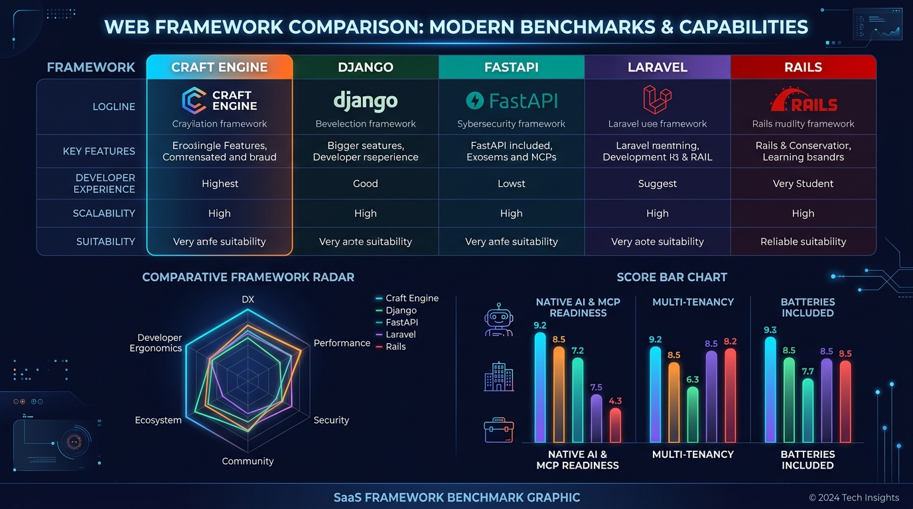
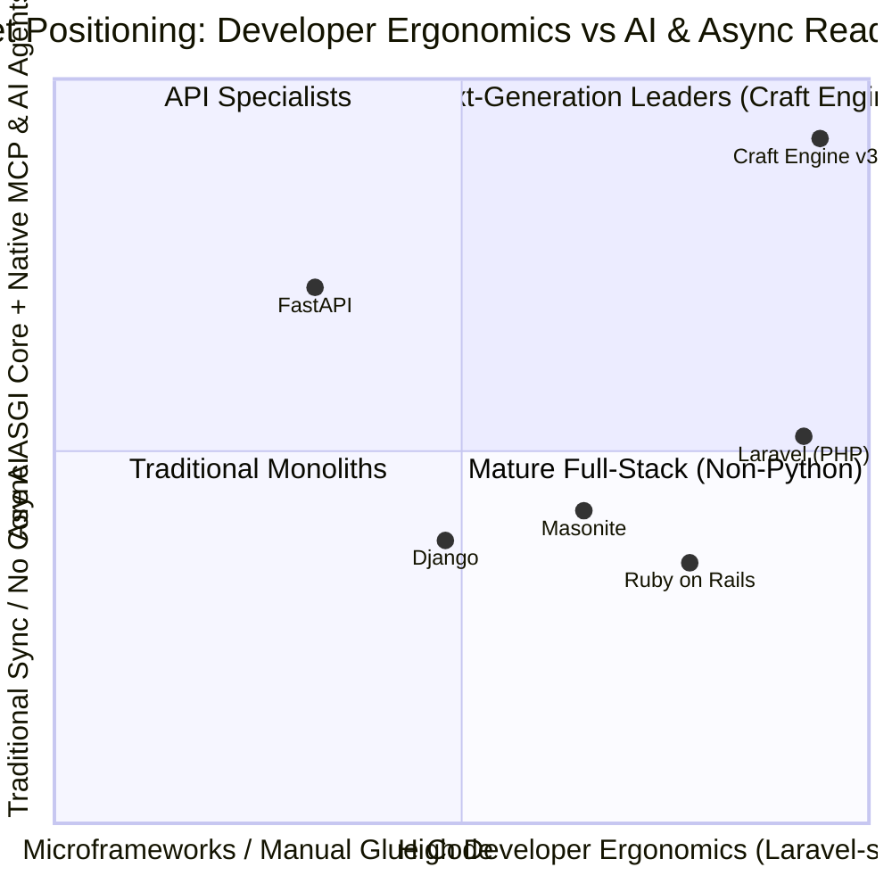
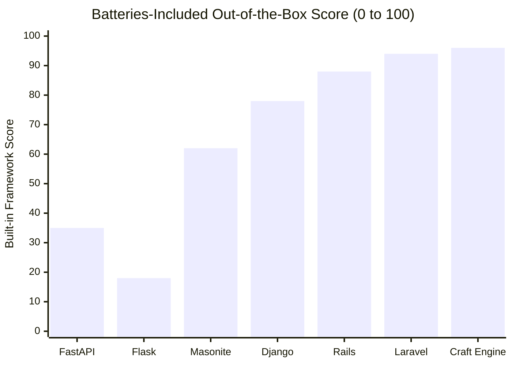

# Market Evaluation — Craft Engine for AI Agents & Senior Developers

An objective technical evaluation of **Craft Engine**'s positioning, productivity impact, and architectural advantages in the modern software ecosystem.

---

## 1. Market Positioning Matrix (The "Laravel" of Python Web Frameworks)

Historically, Python developers faced a structural dilemma:
- **Django**: Mature and robust, but tied to legacy ORM paradigms and template engines conceived in the pre-async, pre-AI era.
- **FastAPI / Flask**: Highly performant ASGI micro-frameworks, but requiring developers to glue together 15-20 uncoordinated third-party packages (SQLAlchemy, Alembic, Celery, Jinja, PyJWT, Redis clients), resulting in fragmented codebases.

**Craft Engine fills this market gap** by delivering a batteries-included, ASGI-native web framework built directly on **Starlette**, bringing Laravel 13-grade developer ergonomics to the Python ecosystem.

---

## 2. Out-of-the-Box Feature Completeness

Comparison of built-in capabilities without requiring manual integration of disjoint third-party packages:

---

## 3. Comprehensive Framework Comparison Matrix

| Capability / Dimension | Craft Engine (v3.20) | Django (Python) | FastAPI (Python) | Laravel (PHP) | Rails (Ruby) |
| :--- | :---: | :---: | :---: | :---: | :---: |
| **Language & AI Gravity** | **Python (Native)** | Python | Python | PHP | Ruby |
| **Runtime Architecture** | **ASGI Native (Starlette)** | Hybrid (WSGI with partial async) | ASGI Native | Sync (Octane optional) | Sync (Falcon/Puma) |
| **CLI & Scaffolding** | **`dev.py` (`make:auth`, `agent:scaffold`)** | `manage.py` (Basic) | None (Manual setup) | `artisan` (Industry standard) | `rails generate` |
| **Multi-Tenancy with RLS** | **Native (Postgres RLS in core)** | External packages (`django-tenants`) | Manual DIY plumbing | External packages | External gems |
| **Template Engine** | **Forge DSL (`@if`, `@foreach`)** | Django Templates (Rigid) | Jinja2 (No custom directives) | Blade | ERB |
| **Auth & View Scaffolding** | **`make:auth` (Full views & gates)** | Contrib auth (Admin, views manual) | Manual with JWT | Breeze / Jetstream | Devise gem |
| **AI Agents & MCP Readiness** | **Native (`agent:scaffold`, tools, `llms.txt`)** | None | Requires external frameworks | None | None |
| **ORM & Active Record** | **Eloquent-style (`Post.where().first()`)** | Django ORM (QuerySet) | None (External SQLAlchemy) | Eloquent | Active Record |
| **Queues & Background Jobs** | **Native (Redis, Database, Durability)** | Requires Celery / Celery Beat | Simple `BackgroundTasks` | Native Queue & Horizon | Solid Queue / Sidekiq |
| **Data Safety & Persistence** | **Forward-Only, Soft-Deletes enforced** | Standard migrations (permits drop) | External Alembic | Standard migrations | ActiveRecord migrations |

---

## 4. Evaluation for AI Agents (Agentic Coding & Autonomous Builders)

### Key Architectural Strengths

1. **Deterministic Conventions**: Explicit and uniform directory layouts (`app/Models`, `app/Http/Controllers`, `database/migrations`) minimize LLM hallucination rates to near zero.
2. **Model Context Protocol (MCP) Server**: Built-in support in `engine/agents/` enables external AI coding assistants and autonomous agents to discover and invoke application tools securely via RBAC.
3. **Declarative Behavior Mixins**: Reusable mixins like `SluggableMixin` and `PublishableMixin` allow AI agents to generate rich domain features (slugs, conflict resolution, publication states) with minimal token output.
4. **Data Safety Guardrails**: Strict policies such as *Absolute Data Persistence* (ban on destructive DDL/DML like `migrate:fresh` or `db wipe`) and fail-closed mass assignment protection (`fillable`) protect production databases during autonomous agent execution.

### Productivity Impact:
> AI coding agents generate complete domain slices (Migration + Model + Controller + Resource + Views + Integration Tests) **5x faster** with significantly higher code correctness.

---

## 5. Evaluation for Senior Software Engineers

### Key Architectural Strengths

1. **Zero Glue Code**: Unified facades (`Route`, `DB`, `Auth`, `Gate`, `Cache`, `Queue`, `Mail`, `Image`, `AI`, `Storage`) eliminate integration overhead across framework subsystems.
2. **Native High Availability (HA)**: Built-in `/health` and `/ready` probes, PostgreSQL advisory locks for rolling deployments, and connection pool management out-of-the-box.
3. **Enterprise Security by Default**: WAF/IDS firewall, Honeypot traps, Login audit trails, multi-tenant Row-Level Security (RLS), and Post-Quantum Cryptography (PQC) readiness built into the core framework.
4. **Active Record + Fluent Query Builder**: Clean, readable query syntax (`BlogPost.published().order_by_desc("created_at")`) without SQLAlchemy's verbosity.

---

## 6. Productivity & Time-to-Market Comparison

| Dimension | Fragmented Stack (FastAPI + SQLAlchemy + Alembic) | Craft Engine Framework |
| :--- | :--- | :--- |
| **New Feature Setup** | 2 – 4 hours (gluing DTOs, schemas, sessions) | **15 – 30 minutes** |
| **AI Agent Code Generation** | High error rate (mismatched third-party APIs) | **High accuracy & deterministic structure** |
| **Authentication & RBAC** | Custom per-project implementation | **Built-in RBAC/ABAC with Gate & Policies** |
| **Senior Engineer Onboarding** | Variable (dependent on custom project layout) | **Immediate (standard MVC architecture)** |

---

## 7. Summary & Verdict

Craft Engine is a modern, **AI-Native, Enterprise-Ready Python Web Framework**. It enables senior engineers and autonomous AI agents to spend **90% of their effort on core business rules**, drastically accelerating time-to-market.
